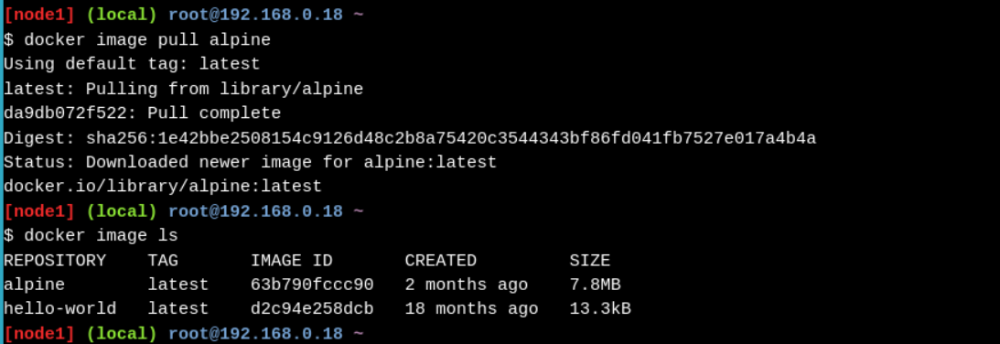
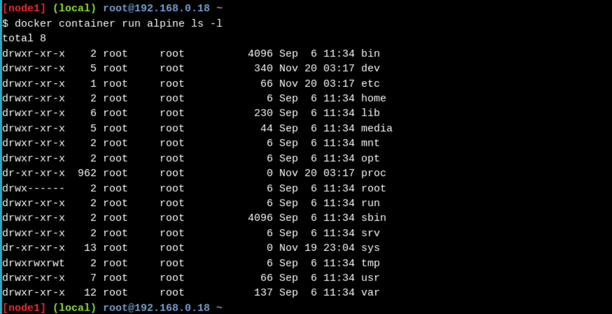

# Play With Docker

# Stage 1

## Objetivos

1. Familiarizarse con los conceptos básicos de Docker.

2. Comprender por qué otros líderes de TI están adoptando rápidamente Docker

3. Ver cómo Docker puede ayudar a su organización

## Primeros contenedores Linux de Alpine

**Conceptos importantes**
 - **La máquina virtual es una abstracción de hardware:**  Toma CPU físicas y RAM de un host y las divide y comparte entre varias máquinas virtuales más pequeñas. Hay un sistema operativo y una aplicación ejecutándose dentro de la máquina virtual, pero el software de virtualización generalmente no tiene conocimiento real de eso.
- **Un contenedor es una abstracción de la aplicación:**  El enfoque se centra en el sistema operativo y la aplicación, y no tanto en la abstracción del hardware. En la actualidad, muchos clientes utilizan tanto máquinas virtuales como contenedores en sus entornos y, de hecho, pueden ejecutar contenedores dentro de las máquinas virtuales.

### 1.1. Imágenes de Docker

Obtenemos la imagen de Docker y luego la listamos con los siguientes comandos:

```bash
docker image pull alpine
```
El comando `pull` obtiene la imagen alpina del registro de Docker y la guarda en el sistema.

```bash
docker image ls
```



Ahora vamos a ejecutar el contendor copn el comando `docker container run`


```bash
docker container run alpine ls -l
```



## Personalización de imágenes de Docker

## Implementación y gestión de varios contenedores 

# Stage 2

## Objetivos

1. Comprender la arquitectura de Docker y las características principales

2. Comprender cómo integrar Docker en su infraestructura de aplicaciones existente

3. Desarrollar una implementación de aplicación de prueba de concepto


```bash
```

```bash
```

```bash
```

```bash
```

```bash
```