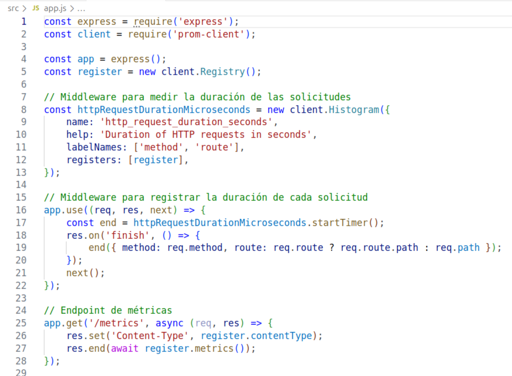
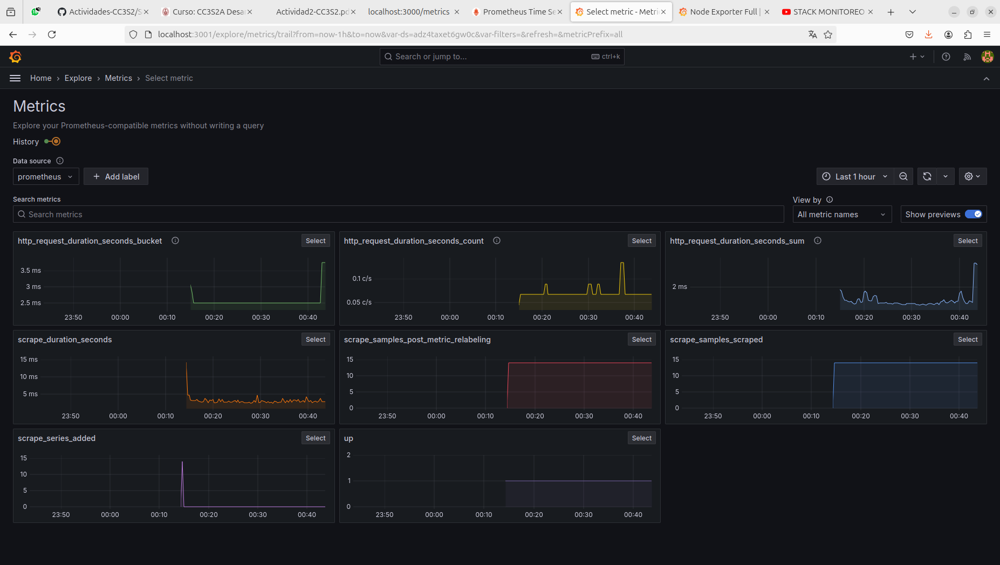
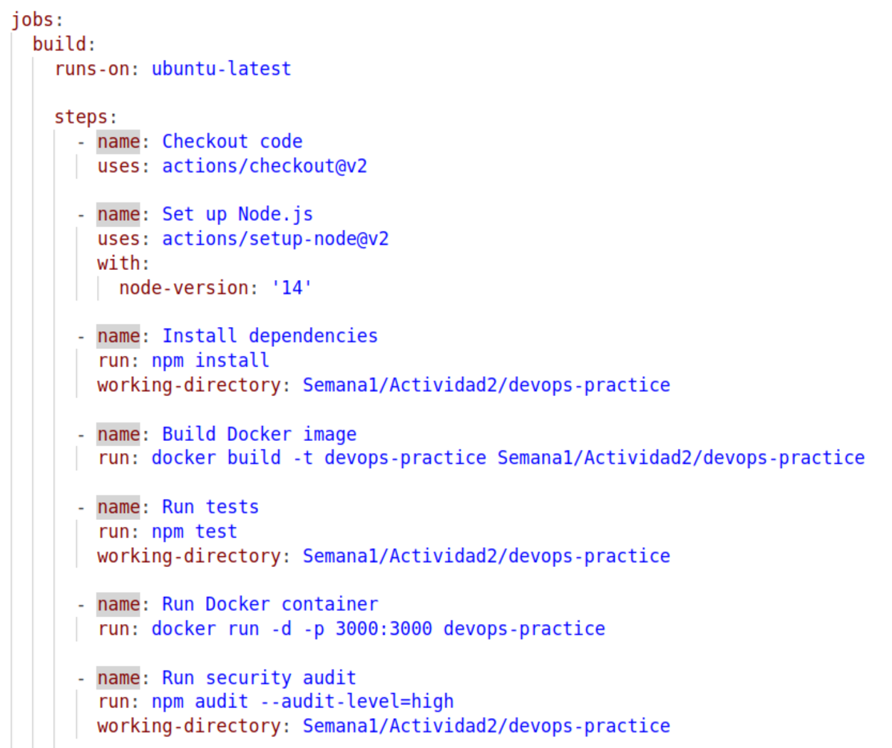

# Instrucciones de la actividad

## 1. Configuración del entorno

### Descripción del proyecto

Este proyecto consiste en una aplicación web sencilla creada con Node.js. La aplicación incluye una API REST básica con un único endpoint que devuelve un mensaje de "Hello, World!". Así como también implementar y configurar en el proyecto herramientas de seguridad y monitoreo como Prometheus y Grafana.

### Pasos para configurar el entorno

#### 1.1 Inicializa el proyecto 

```bash
mkdir devops-practice
cd devops-practice
npm init -y
```
Creamos un nuevo directorio llamado devops-practice, nos movemos a ese directorio y inicializamos un nuevo proyecto de Node.js con un archivo package.json predeterminado.


#### 1.2. Instala las Dependencias Necesarias

Comando:

```
npm install express jest supertest
```
Instalamos express para crear la API y jest para las pruebas unitarias. Supertest se usa para realizar pruebas sobre los endpoints de la API.

#### 1.3. Crea la estructura del proyecto:
```bash
mkdir src tests
touch src/app.js tests/app.test.js
```


#### 1.4. Implementa la API REST en src/app.js:

```bash
const express = require('express');
const app = express();

app.get('/', (req, res) => {
    res.send('Hello, World!');
});

app.get('/delay', (req, res) => {
    setTimeout(() => {
        res.send('This was delayed by 2 seconds');
    }, 2000);
});

module.exports = app;

if (require.main === module) {
    const port = process.env.PORT || 3000; 
    app.listen(port, () => {
        console.log(`Server running on port ${port}`);
    });
}
```

#### 1.5. Escribe un test básico en tests/app.test.js
```bash
const request = require('supertest');
const app = require('../src/app');

describe('GET /', () => {
    let server;

    beforeAll(() => {
        server = app.listen(0); // Usar 0 permite al sistema asignar un puerto libre automáticamente
    });

    afterAll(() => {
        server.close(); // Cierra el servidor después de que las pruebas hayan terminado
    });

    it('should return Hello, World!', async () => {
        const res = await request(app).get('/');
        expect(res.statusCode).toEqual(200);
        expect(res.text).toBe('Hello, World!');
    });
});

describe('GET /delay', () => {
    let server;

    beforeAll(() => {
        server = app.listen(0); // Usar 0 permite al sistema asignar un puerto libre automáticamente
    });

    afterAll(() => {
        server.close(); // Cierra el servidor después de que las pruebas hayan terminado
    });

    it('should return after a delay', async () => {
        const start = Date.now();
        const res = await request(app).get('/delay');
        const end = Date.now();
        const duration = end - start;
        
        expect(res.statusCode).toEqual(200);
        expect(res.text).toBe('This was delayed by 2 seconds');
        expect(duration).toBeGreaterThanOrEqual(2000);
    });
});

```

#### 1.6. Configura el Script de Test en package.json
```bash
{
  "name": "devops-practice",
  "version": "1.0.0",
  "main": "src/app.js",
  "scripts": {
    "test": "jest --detectOpenHandles"
  },
  "keywords": [],
  "author": "",
  "license": "ISC",
  "description": "",
  "dependencies": {
    "express": "^4.19.2"
  },
  "devDependencies": {
    "jest": "^29.7.0",
    "supertest": "^6.3.4"
  }
}
```
Se agregó `--detectOpenHandles` para detectar que las funciones asíncronas que seguían ejecutándose después de los tests.

#### 1.7. Ejecución de test
Para verificar que la aplicación funciona bien ejecutamos las pruebas en el terminal con `npm test` desde la raiz del proyecto.


### 2. Pipeline CI/CD

 **Parte 1: Configuración de Integración Continua (CI) con GitHub Actions**

#### 2.1. Crea un Archivo de Configuración para GitHub Actions

```bash
mkdir -p .github/workflows
touch .github/workflows/ci.yml
```

#### 2.2 Automatiza el análisis de seguridad en GitHub Actions:


```bash
name: CI Pipeline

on:
  push:
    branches:
      - main
  pull_request:
    branches:
      - main

jobs:
  build:
    runs-on: ubuntu-latest

    steps:
      - name: Checkout code
        uses: actions/checkout@v2

      - name: Set up Node.js
        uses: actions/setup-node@v2
        with:
          node-version: '14'

      - name: Install dependencies
        run: npm install

      - name: Run tests
        run: npm test

      - name: Run security audit
        run: npm audit --audit-level=high

```
Configuramos un flujo de trabajo para GitHub Actions que instala las dependencias y ejecuta los tests en cada `push` o `pull request` a la rama `main`.

#### 2.3. Implementación de Infraestructura como Código (IaC)

Usa Docker para contenerizar la aplicación:

```bash
# Usa la imagen oficial de Node.js
FROM node:14

# Establece el directorio de trabajo en el contenedor
WORKDIR /app

# Copia los archivos package.json y package-lock.json
COPY package*.json ./

# Instala las dependencias
RUN npm install

# Copia el resto de los archivos de la aplicación
COPY . .

# Expone el puerto en el que la aplicación correrá
EXPOSE 3000

# Comando para iniciar la aplicación
CMD ["node", "src/app.js"]
```

Para crear el archivo `Dockerfile` nos ubicamos en la raíz del proyecto `$ devops-practice` y colocamos:
```bash
touch Dockerfile
nano Dockerfile
```
El primero crea el archivo y el segundo nos permite editar el contenido del archivo. 

#### 2.5. Construye la Imagen de Docker

```bash
docker build -t devops-practice .
```

#### 2.6. Corre el Contenedor Localmente

```bash
docker run -p 3000:3000 devops-practice
```

Abre un navegador web y accede a http://localhost:3000 para verificar que la aplicación esté funcionando.


#### Ejecutamos las pruebas de la app dentro del docker y los test pasaron sin problemas.


### 3. Automatización
- Automatiza la configuración y gestión del entorno local usando Docker Compose:

#### 3.1. Crea un archivo `docker-compose.yml`

```bash
version: '3.8'
services:
  app:
    build: .
    ports:
      - "3000:3000"
    environment:
      - NODE_ENV=production
```

#### 3.2. Corre la Aplicación Usando Docker Compose:

Ejecuta el siguiente comando para construir la imagen y levantar el contenedor en segundo plano:

```bash
docker-compose up --build -d
```


- **Importante**: Antes de ejecutar este comando, asegúrate de que el puerto 3000 esté disponible. Si el puerto está ocupado, podrías recibir un error.

#### Pasos para liberar el puerto 3000:

Lista los contenedores activos:
```bash
docker ps
```

Detén los contenedores que usan el puerto 3000:
```bash
docker stop <container_id>
```
Forzar el cierre de contenedores:

```bash
docker kill <container_id>
```

También puedes usar el siguiente comando:

```bash
sudo lsof -i :3000
```
Lista los procesos que ocupan el puerto 3000. Para detener este proceso, usa el PID (ID del proceso) mostrado en la salida de `lsof`:

```bash
sudo kill -9 <PID>
```
Fuerza el cierre del proceso.


### 4. Configura Prometheus y Grafana para monitorear la aplicación:

#### 4.1. Crea un archivo prometheus.yml para configurar Prometheus:
```
global:
  scrape_interval: 15s

scrape_configs:
  - job_name: 'node-app'
    static_configs:
      - targets: ['app:3000']
```

#### 4.2. Configura Grafana utilizando un docker-compose.yml actualizado:

```
version: '3.8'

services:
  app:
    build: .
    ports:
      - "3000:3000"
    environment:
      - NODE_ENV=production
    networks:
      - monitoring

  prometheus:
    image: prom/prometheus
    volumes:
      - ./prometheus.yml:/etc/prometheus/prometheus.yml
    ports:
      - "9090:9090"
    networks:
      - monitoring

  grafana:
    image: grafana/grafana
    ports:
      - "3001:3000"
    networks:
      - monitoring

networks:
  monitoring:
``` 

### Resultados obtenidos de Prometheus y Grafana
Si nos dirigimos a http://localhost:9090 y vamos a **targets** observaremos que Prometheus está corriendo correctamente: 


Si nos dirigimos a http://localhost:3000/metrics observaremos algo parecido a eso: 


### Importante: Hay que configurar primero nuestro archivo app.js para poder ver las métricas de Prometheus

**Paso 1:**  Instalar prom-client

```
npm install prom-client
```
**Paso 2:** Importamos `prom-client` a nuestra aplicación
```
const client = require('prom-client');
const register = new client.Registry();
```
**Paso 3:**  Configuramos un middleware para medir la duración de las solicitudes Y para registrar la duración de cada solicitud.
```
const httpRequestDurationMicroseconds = new client.Histogram({
    name: 'http_request_duration_seconds',
    help: 'Duration of HTTP requests in seconds',
    labelNames: ['method', 'route'],
    registers: [register],
});

app.use((req, res, next) => {
    const end = httpRequestDurationMicroseconds.startTimer();
    res.on('finish', () => {
        end({ method: req.method, route: req.route ? req.route.path : req.path });
    });
    next();
});
```
**Paso 4:** Por último agregamos el endpoint de métricas que es la solicitud que se realiza para vizualizarlas.
```
app.get('/metrics', async (req, res) => {
    res.set('Content-Type', register.contentType);
    res.end(await register.metrics());
});
```
Debería quedar algo así: 


#### Representación de las métricas en Grafana

En Grafana nos dirigimos a http://localhost:3001 


Luego en Dashboards crearemos uno, por defecto escogeremos Prometheus si nos piden la `URL` colocar en la que se genera dentro del contenedor, por ejemplo en mi caso por defecto el la imagen se contruye con nombre `devops-practice-prometheus` entonces la `URL`ingresada debería ser `http://devops-practice-prometheus:9090`. 
Una vez configurado eso simplemente elegimos una métrica y lo ejecutamos y obtendremos las gráficas.




### Github Actions

Podemos observar como se completó exitosamente el proceso todos los trabajos en el archivo ci.yml se ejecutaron sin errores. Para ello tuvimos que añadir el campo `working-directory` en las etapas `Install dependencies` y `Run tests` para especificar la ruta correcta donde se encuentran los archivos del proyecto dentro del repositorio. Esto garantiza que los comandos  `npm install`, `npm audit` y `npm test` se ejecuten en el contexto adecuado.




## Conclusión

En este proyecto, hemos creado una app básica con Node.js que incluye una API REST simple. A lo largo de diferentes etapas, logramos:

**Configuración del Entorno:** Desde el inicio del proyecto hasta la instalación de las herramientas necesarias, establecimos una base sólida. Además, al incluir pruebas, aseguramos que nuestra API funcione correctamente.

**Pipeline CI/CD:** Configuramos GitHub Actions para automatizar el proceso de integración continua. Esto significa que cada vez que hacemos cambios en el código, se realizan pruebas y se revisan posibles problemas de seguridad.

**Contenerización:** Utilizamos Docker para empaquetar la aplicación, lo que facilita su despliegue en diferentes entornos y simplifica la gestión de dependencias.

**Monitoreo:** Implementamos Prometheus y Grafana para seguir el rendimiento de la aplicación. Esto nos ayuda a estar al tanto de métricas importantes y a asegurarnos de que todo funcione bien en producción.

**Automatización y Mantenimiento:** Usar Docker Compose nos permite manejar múltiples servicios de manera sencilla, lo que mejora la gestión del entorno de desarrollo.
