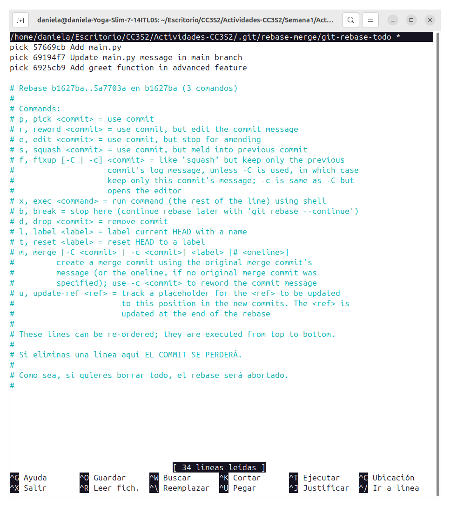
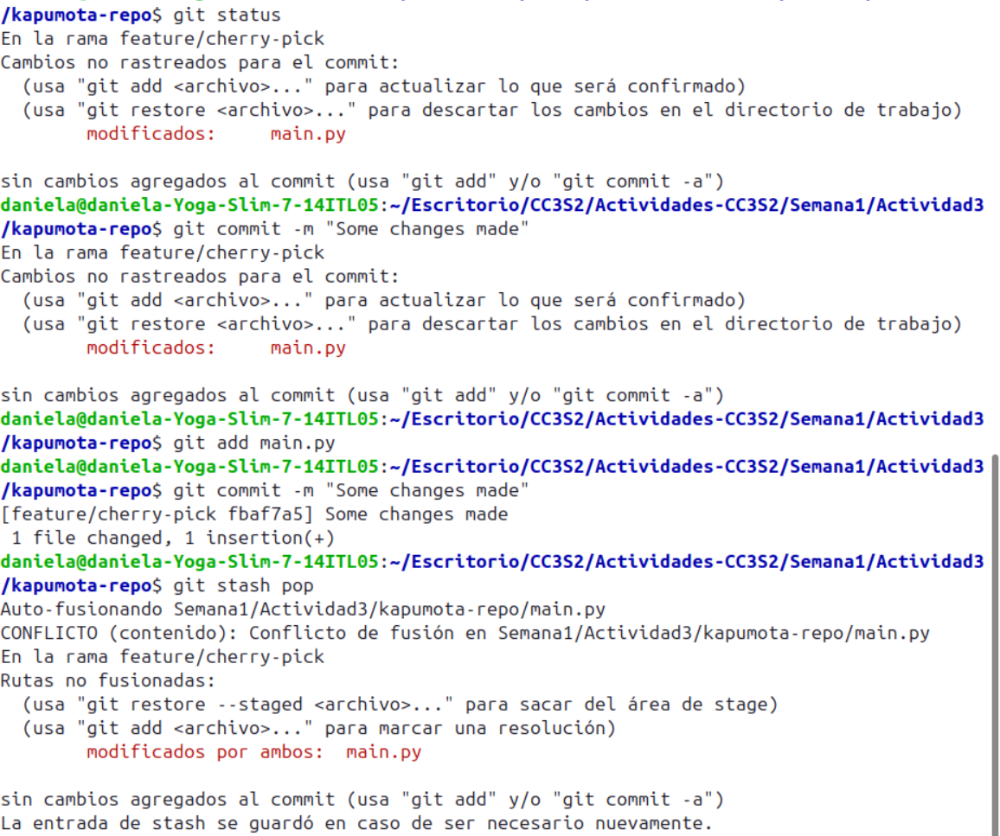

# Introducción a Git - conceptos básicos y operaciones esenciales

Antes de comenzar un proyecto en Git, es importante que te presentes. Esto se hace mediante el comando `git config`, que establece tu nombre de usuario y tu correo electrónico. Esta información se incluirá en cada commit que realices, lo que te permite identificar quién hizo qué cambios en el proyecto.

## Configuración de usuario

Para presentarte a Git, ejecuta los siguientes comandos en tu terminal:

```bash
git config --global user.name "Kapumota"
git config --global user.email "kapumota@example.com"
```

## Inicializando un Repositorio

Para iniciar un nuevo repositorio de Git, puedes usar el siguiente comando:

```bash
mkdir kapumota-repo
git init
```

Otra forma es pasar un nombre de directorio como argumento:

```bash
git init kapumota-repo
```

Esto creará el directorio sin necesidad de ejecutar `mkdir`.

## Crear un archivo README.md

Preparar y confirmar el archivo:
```
echo "README" > README.md
git add README.md
git commit -m "Initial commit with README.md"
```
Ver el historial de commits:
```bash
git log
```

Ver el historial de una forma más compacta:
```bash
git log --oneline
```

## Manejo de Branches

```bash
git branch feature/new-feature
git checkout feature/new-feature
```
o también puede usar lo siguiente que básicamente crea y cambia a la rama nueva.
```bash
git checkout -b feature/new-feature
```


Hacer cambios, preparar y confirmar:

```bash
echo "Nuevo contenido" >> archivo.txt
git add archivo.txt
git commit -m "Agregar nuevo contenido"

```
Fusionar la branch:
```bash
git checkout main
git merge feature/new-feature
```

Eliminar la rama
```bash
git branch -d feature/new-feature
```
### Resolución de conflictos
Simular un conflicto al modificar el mismo archivo en dos branches diferentes, y fusionar:

```bash
# Cambiar a main y editar archivo.txt
git checkout main
echo "Cambio en main" > archivo.txt
git add archivo.txt
git commit -m "Cambios en main"

# Cambiar a la otra branch y hacer cambios diferentes
git checkout feature/new-feature
echo "Cambio en feature" > archivo.txt
git add archivo.txt
git commit -m "Cambios en feature"

# Intentar fusionar
git checkout main
git merge feature/new-feature
```

## Ejercicio 1: Manejo avanzado de branches y resolución de conflictos

**Objetivo:** Practicar la creación, fusión y eliminación de ramas, así como la resolución de conflictos que puedan surgir durante la fusión.

**Instrucciones:**

1. Crear una nueva rama para una característica

    ```bash
    git branch feature/advanced-feature
    git checkout feature/advanced-feature
    ```

2. Modificar archivos en la nueva rama:

   - Edita el archivo main.py para incluir una función adicional:


    - Añade y confirma estos cambios en la rama feature/advanced-feature:
        ```bash
        git add main.py
        git commit -m "Add greet function in advanced feature"
        ```
        
        
        Se puede observar los cambios que se han hecho.

3. Simular un desarrollo paralelo en la rama main:

    - Cambia de nuevo a la rama main:

        ```
        git checkout main
        ```
    - Edita `main.py` de forma diferente:

        ```python
        print('Hello World - updated in main')
        ```
        

    - Añade y confirma estos cambios:
        ```bash
        git add main.py
        git commit -m "Update main.py message in main branch"
        ```
4. Intentar fusionar la rama `feature/advanced-feature` en `main`:

    ```
    git merge feature/advanced-feature
    ```

5. Resolver el conflicto de fusión:
    
    - Abre `main.py` y resuelve el conflicto manualmente.
    - Después de resolver, añade el archivo resuelto y completa la fusión:

    ```bash
    git add main.py
    git commit -m "Resolve merge conflict between main and feature/advanced-feature"
    ```
    

6. Eliminar la rama fusionada:
    ```bash
    git branch -d feature/advanced-feature
    ```

## Ejercicio 2: Exploración y Manipulación del Historial de Commits

**Objetivo:** Aprender a navegar y manipular el historial de commits usando comandos avanzados de Git.

**Instrucciones:**

1. **Ver el historial detallado de commits:**
    ```bash
    git log -p
    ```

2. **Filtrar commits por autor:**
    ```bash
    git log --author="TuNombre"
    ```
    

3. **Revertir un commit:**
    ```bash
    git revert HEAD
    ```

4. **Rebase interactivo:**
    ```bash
    git rebase -i HEAD~3
    ```

5. **Visualización gráfica del historial:**
    ```bash
    git log --graph --oneline --all
    ```

## Ejercicio 3: Creación y Gestión de Branches desde Commits Específicos

**Objetivo:** Practicar la creación de ramas desde commits específicos y comprender cómo Git maneja las referencias históricas.

**Instrucciones:**

1. **Crear una nueva rama desde un commit específico:**
   ```bash
   git log --oneline
   git branch bugfix/rollback-feature <commit-hash>
   git checkout bugfix/rollback-feature
   ```
    
2. **Modificar y confirmar cambios en la nueva rama:**
   ```python
   def greet():
       print('Fixed bug in feature')
   ```
   ```bash
   git add main.py
   git commit -m "Fix bug in rollback feature"
   ```

3. **Fusionar los cambios en la rama principal:**
   ```bash
   git checkout main
   git merge bugfix/rollback-feature
   ```
    
    Como podemos observar hay conflcito al momento de hacer el merge, por lo tanto debemos de arreglarlo manualemente.

4. **Explorar el historial después de la fusión:**
   ```
   git log --graph --oneline
   ```

5. **Eliminar la rama `bugfix/rollback-feature`:**
   ```bash
   git branch -d bugfix/rollback-feature
   ```

## Ejercicio 4: Manipulación y Restauración de Commits con `git reset` y `git restore`

**Objetivo:** Comprender cómo usar `git reset` y `git restore` para deshacer cambios en el historial y en el área de trabajo.

**Instrucciones:**

1. **Hacer cambios en el archivo `main.py`:**
   ```python
   print('This change will be reset')
   ```
   ```bash
   git add main.py
   git commit -m "Introduce a change to be reset"
   ```
   

2. **Usar `git reset` para deshacer el commit:**
   ```bash
   git reset --hard HEAD~1
   ```
   

3. **Usar `git restore` para deshacer cambios no confirmados:**
   ```bash
   echo "Another line in README" >> README.md
   git status
   git restore README.md
   ```
   


## Ejercicio 6: Cherry-Picking y Git Stash

**Objetivo:** Aprender a aplicar commits específicos a otra rama utilizando `git cherry-pick` y a guardar temporalmente cambios no confirmados utilizando `git stash`.

**Instrucciones:**

1. **Hacer cambios en `main.py` y confirmarlos:**
   - Realiza y confirma varios cambios en `main.py` en la rama `main`:
        ```bash
        echo "print('Cherry pick this!')" >> main.py
        git add main.py
        git commit -m "Add cherry-pick example"
        ```
        

2. **Crear una nueva rama y aplicar el commit específico:**
   - Crea una nueva rama `feature/cherry-pick` y aplícale el commit específico:
        ```bash
        git branch feature/cherry-pick
        git checkout feature/cherry-pick
        git cherry-pick <commit-hash>
        ```
        

        Debemos de solucionar el conflicto

        
        

3. **Guardar temporalmente cambios no confirmados:**
   - Realiza algunos cambios en `main.py` pero no los confirmes:
        ```bash
        echo "This change is stashed" >> main.py
        git status
        ```
   - Guarda temporalmente estos cambios utilizando `git stash`:
        ```bash
        git stash
        ```
        

4. **Aplicar los cambios guardados:**
   - Realiza otros cambios y confírmalos si es necesario.
   - Luego, recupera los cambios guardados anteriormente:
        ```bash
        git stash pop
        ```
        

5. **Revisar el historial y confirmar la correcta aplicación de los cambios:**
   - Usa `git log` para revisar el historial de commits y verificar que todos los cambios se han aplicado correctamente.

