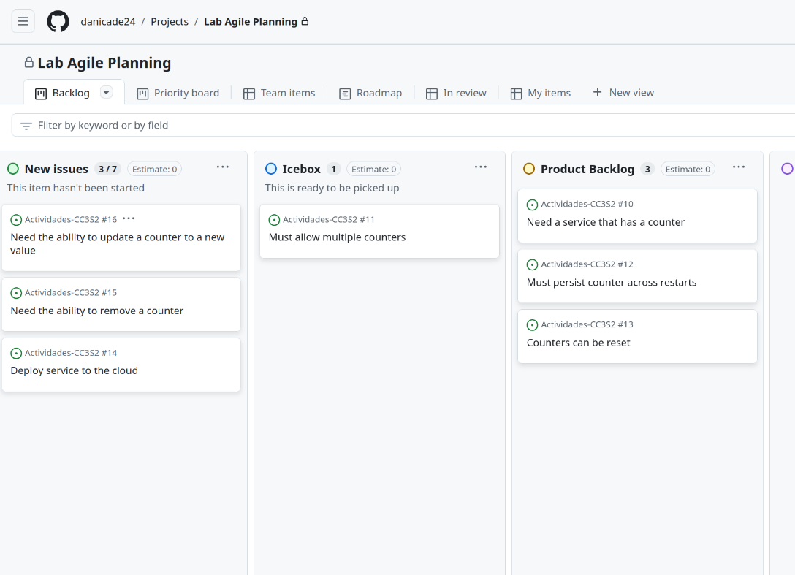

## Actividad 7

### **Gestión Ágil de Proyectos con GitHub Projects**

**Objetivo general**
-
Configurar un Kanban Board en GitHub Projects y gestionar el backlog mediante la creación y priorización de historias de usuario. Esto permite a los equipos de desarrollo organizar su trabajo de manera eficiente, visualizando el estado de las tareas y las prioridades.

---

#### **Parte 1: Configuración del Kanban Board**

1. **Navegar al repositorio** en GitHub y seleccionar la pestaña **Projects**:
   - 

2. Crear un nuevo proyecto **Kanban** llamado "Lab Agile Planning":
   - 

3. Personalizar las columnas del Kanban para adaptarse a las necesidades del equipo:
   - **Renombrar "Ready" a Icebox**: La columna Icebox se usa para almacenar ideas o tareas que aún no están listas para ser trabajadas, pero que pueden ser priorizadas más tarde.
   - **Dejar "In Progress" y "Done" sin cambios**.
   - **Renombrar "In review" a Review/QA**.
   - **Crear y posicionar columnas adicionales**: Se añade una columna **Product Backlog** para almacenar las tareas listas para el sprint y una columna **Sprint Backlogs** para las tareas activas del sprint.
   - 

---

#### **Parte 2: Creación de una Plantilla de Historias de Usuario**

1. Navegar a **Settings** del repositorio y seleccionar **Set up templates**:
   - 

2. Crear una plantilla personalizada **Custom template** con el nombre **User Story**:
   - 

3. Usar el siguiente formato Markdown para las historias de usuario:
   ```markdown
   ## User Story
   - As a [user role]
   - I need [functionality] 
   - so that [benefit].
   ```

   Utilizar plantillas nos garantiza que todos los miembros del equipo estén sigan una estructura coherente para crear las historias de usuario. 

   Ahora debería haberse creado una nueva carpeta en tu repositorio llamada
.github/ISSUE_TEMPLATES, que contendrá tu nueva issue template de historia de usuario.

   
   
---

#### **Parte 3: Creación de Historias de Usuario**

1. Crear las siguientes historias de usuario basadas en los requisitos del proyecto:
   - **Need a service that has a counter**.
   - **Must allow multiple counters**.
   - **Must persist counter across restarts**.
   - **Counters can be reset**.
   - Deploy service to the cloud
   - Need the ability to remove a counter
   - Need the ability to update a counter to a new value
   - 

2. Priorizar estas historias en el Kanban Board:
   - Mover las historias a las columnas apropiadas:
     - **Need a service that has a counter**: Colocarla en la columna **Product Backlog**.
     - **Must allow multiple counters**: Mover a la columna **Icebox**.
     - **Must persist counter across restarts** y **Counters can be reset**: Mover a **Product Backlog**.
   - 

---

#### **Parte 4: Refinamiento del Backlog**

1. Mover las historias de la columna **New Issues** a las columnas apropiadas:
   - 

Luego del triage nuestro kanban board debe de verse asi


2. Añadir detalles a las historias en la columna **Product Backlog**:
   - Es crucial agregar más contexto a las historias para que los desarrolladores tengan toda la información que necesitan.
   - 
   - 
   - 
   - 
    
   Luego de esto el Kanban board debería de tener suficientes detalles en todas las historias del Product Backlog quedando listas para el sprint.

3. Crear etiquetas nuevas como **technical debt**:
   - Las etiquetas nos ayudan a organizar y clasificar las historias de usuario.
   - 

    Este paso permite asegurar que todas las historias estén bien definidas y listas para ser desarrolladas en el sprint.

---
### Ejercicio 1

- Crear un Epic y vincular historias de usuario

   Creamos un nuevo issue al cual llamamos **Gestión de Contadores** y lo asociamos a historias creadas anteiormente.

   

### Ejercicio 2

-  Usaremos las etiquetas de manera más detallada para indicar la prioridad y el estado de las historias.
   Prmero creamos más etiquetas que representarán distintos estados de las historias como `hight priority` ,`low priority` también `ready for testing`, `in review`, etc.

   

   Así quedaría luego de asignarle algunas etiquetas a las historias
   
   


---
#### Conclusión: 

Gracias a esta actividad, tuve la oportunidad de aprender a utilizar una herramienta muy útil como el Kanban Board, que facilita la planificación y el seguimiento de proyectos, especialmente en un entorno de trabajo grupal. La posibilidad de compartir el tablero con los miembros del equipo nos permite a todos tener una visión clara y actualizada del progreso de cada tarea. De esta manera, todos pueden ver en qué estado se encuentran las historias de usuario, qué tareas están en progreso y cuáles ya se han completado, mejorando la coordinación y la colaboración entre los integrantes del equipo.

