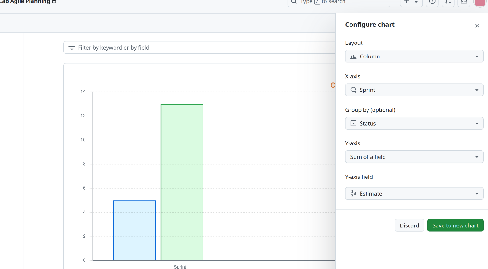

## Actividad 8

### **Actividad: Gestión Ágil de Sprints con GitHub**

**Objetivo general**: Configurar y gestionar sprints en GitHub para organizar y ejecutar de manera efectiva un ciclo de desarrollo ágil. Esta actividad incluye la creación de sprints, la estimación de puntos de historia y el uso de un burndown chart para rastrear el progreso del equipo.

---

#### **Parte 1: Configuración de Sprints**

1. **Abrir GitHub y navegar al Kanban Board**:
   - Aquí se accederá al proyecto en GitHub luego abrir el Kanban Board que se configuró en actividades anteriores. Este será el punto de partida para la planificación y gestión de sprints.
   - 

2. **Configurar el sprint**:
   - En esta sección, se creará los sprints necesarios. GitHub permite configurar sprints predeterminados que se repetirán automáticamente si no se especifican manualmente.
   - Hacer clic en el botón desplegable junto a **Backlog** y selecciona la opción para crear un nuevo campo llamado "Sprint". Esto permitirá gestionar las iteraciones de trabajo dentro del tablero.
   - 

3. **Asignar historias de usuario a un sprint**:
   - Una vez creado el sprint, es necesario asignar las historias del **Product Backlog** a este sprint. Para ello, se debe seleccionar una historia, se le asigna una estimación de puntos de historia (por ejemplo, 8 puntos para una historia grande) y se elige el sprint adecuado para esa tarea.
   - 

4. **Construir el Sprint Backlog**:
   - Mover las historias desde el **Product Backlog** al **Sprint Backlog** para reflejar las tareas que se trabajarán en la iteración actual. Hay que asegurarse de que todas las historias asignadas al sprint tengan una estimación de puntos adecuada. (Los números en los círculos son los puntos de estimación)
   - 

    Este paso es importante para poder planificar de manera realista el trabajo que se puede completar en el sprint. Asegurarse de que cada historia tiene una estimación precisa y bien asignada nos ayudará a evitar retrasos en la entrega del proyecto.

---

#### **Parte 2: Flujo de trabajo diario**

1. **Asignar historias de usuario y moverlas a "In Progress"**:
   - Durante el sprint, cada desarrollador seleccionará las historias en las que va a trabajar. Una vez asignada una historia, se debe mover a la columna **In Progress** para indicar que está en desarrollo.
   - 

2. **Revisión y completado de historias**:
   - Cuando una historia esté completa, se debe mover a la columna **Review/QA** para que otro miembro del equipo la revise. Una vez aprobada, se moverá a la columna **Done**. Se sigue ese flujo con todas historias que están en la columna **Sprint Backlogs**.

    Luego de que los dos primeros estén en la columna **Done** nuestro Kanban debe de verse así:

   - 

   Seguir este flujo diario asegura que el trabajo esté siempre visible y que todos en el equipo puedan ver en qué estado se encuentran las tareas. Además, facilita el seguimiento de qué historias están en progreso y cuáles están listas para revisión.

---

#### **Parte 3: Configuración del Burndown Chart**

1. **Generar un burndown chart**:
   - El burndown chart es una herramienta visual para rastrear el progreso del sprint. Este gráfico muestra la cantidad de trabajo restante en función del tiempo, lo que permite ver si el equipo está en camino de completar todas las historias asignadas dentro del tiempo del sprint.
   - Para crear este gráfico en GitHub, haz clic en el menú desplegable junto a **Backlog** y selecciona **Generate chart**.
   - Nos debería quedar algo parecido a eso:

   - 

2. **Configurar los detalles del burndown chart**:
   - Personaliza el gráfico filtrando por las historias que están en la columna **Done** y agrupando los datos por puntos de historia. Esto permitirá visualizar claramente qué tanto trabajo ha sido completado y cuánto falta por hacer.
   - PRimero debemos ajustar los campos seleccioanndo los mismos que de la imagen:

   - 

   - Ahora nuestra gráfica se ve así:
     
     
    
    - Del Sprint 1:

        

   **Comentarios adicionales**: El burndown chart es una herramienta clave para monitorear el progreso del sprint. Proporciona una visión clara de si el equipo está avanzando según lo planeado o si es necesario hacer ajustes.

---

#### **Parte 4: Gestión del trabajo incompleto**

1. **Ajustar los puntos de historia para las historias incompletas**:
   - Al final del sprint, es posible que algunas historias no se completen. En este caso, se deben ajustar los puntos de historia para reflejar el esfuerzo realizado y luego mover estas historias a la columna **Done**.

   - 
   - 

2. **Crear nuevas historias para el trabajo pendiente**:
   - Si una historia no se completó, es importante crear una nueva historia para documentar el trabajo restante y asegurarse de que esté lista para el próximo sprint.

    

    - Lo asiganmos a **Product Backlogs** 

    

   Este paso asegura que no se pierda el trabajo pendiente y que el equipo pueda continuar de manera eficiente en el siguiente sprint, refinando el backlog para mantener la productividad.

    Al final nos queda nuestra tablero de la sigueinte manera:

    
---

#### **Conclusión**

Esta actividad me permitió aprender a gestionar un ciclo completo de sprint utilizando GitHub, desde la planificación inicial hasta el cierre del sprint. El uso de herramientas como el Kanban Board* y el burndown chart proporciona una visión clara del progreso y facilita la colaboración en equipo. Además, aprender a gestionar historias incompletas asegura que el backlog se mantenga organizado y actualizado, mejorando así la eficiencia en futuros sprints. Y al poder compartir mi proyecto con mis compañeros cada uno de nosotros podia asignarse una historia dándonos una visión más clara sobre como gestionar proyectos futuros siendo más ordenados y teniendo establecido debidos tiempos, además con el uso de un burndown chart podremos rastrear el progreso del equipo. 

---
### **Nota:** 
Decidí volver a realizar la actividad en este repositorio, pero este proyecto fue realizado anteriormente en un repositorio grupal [CC3S2-GRUPO11](https://github.com/users/danicade24/projects/4/views/1) en ese link se encontrará la elaboración del mismo Kanban Board. 