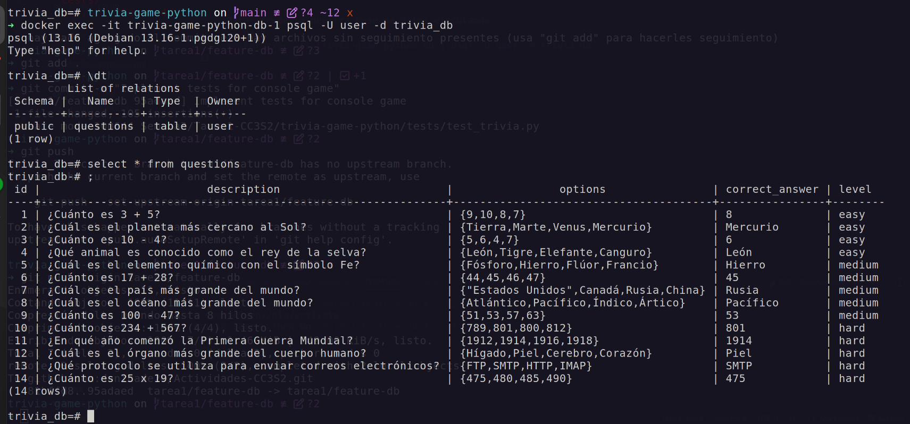
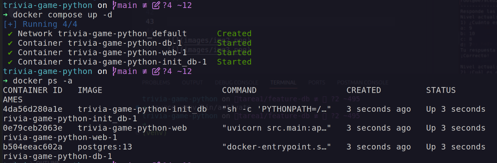
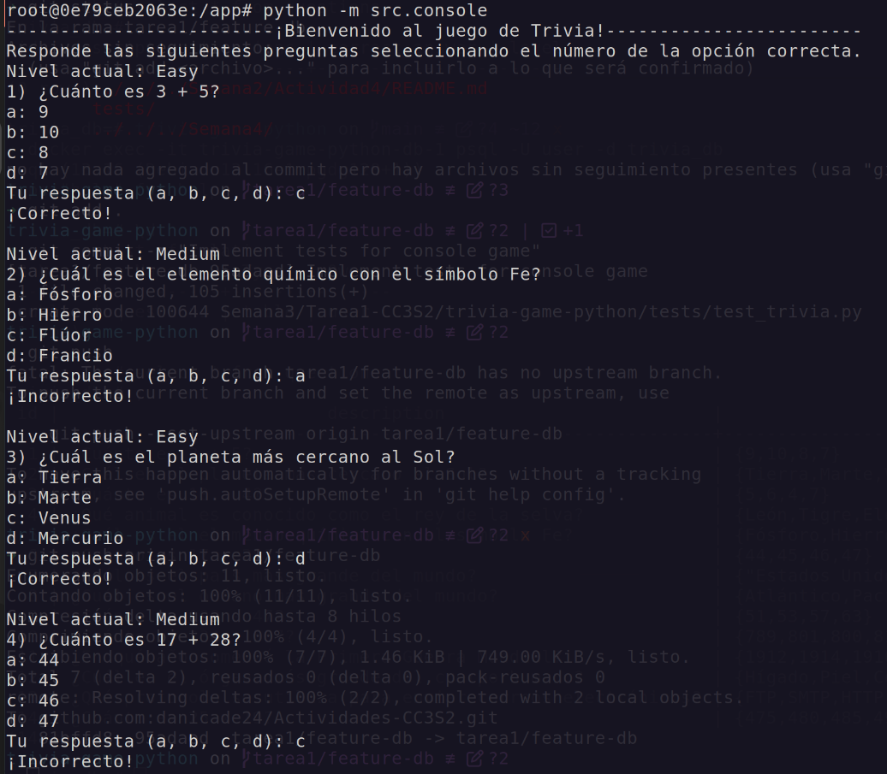
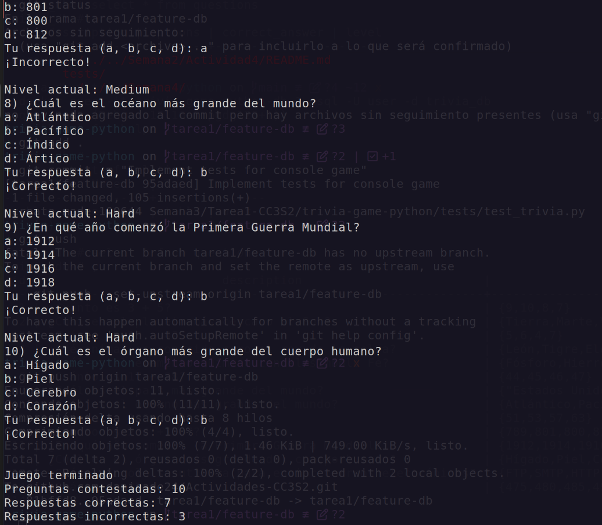

## Tarea 1: Juego de trivia

### Descripción del juego

Es un juego de preguntas y respuestas donde los jugadores deben de responder preguntas con opción múltiples, es decir, cada pregunta tendrá una sola respuesta correcta.

### Reglas del juego

- El juego constará de 10 rondas con preguntas únicas
- Cada pregunta cuenta con 4 opciones de posibles respuestas numeradas. Solo una opción es la correcta.
- El jugador elige su respuesta ingresando el número correspondiente a la opción elegida.
- Cada respuesta correcta otorga un punto al jugador y las respuestas incorrectas no se penalizan.
- Al finalizar el juego, se mostrará la puntuación total del jugador junto con el número de respuestas correctas e incorrectas.

Primero construimos el contenedor de docker-compose con el comando:
```bash
docker compose up --build
```

Para acceder a nuestra base de datos ejecutamos
```bash
docker exec -it trivia-game-python-db-1 psql -U user -d trivia_db
```



## Ejecución del juego dentro del contenedor

Para ejecutar nuestro juego dentro del contenedor primero construimos nuestro contenedor con el comando:

```bash
docker compose build

docker compose up -d
```

Una vez que verificamos que nuestros contenedores estan ejecutandose correctamente con:

```bash
docker ps -a
```



Ahora para correr nuestra aplicación y jugar por consola ejecutamos:

```bash
docker compose exec web /bin/bash
```
Una vezz dentro del bash de nuestro contenedor ejecutamos: 
```bash
python src/console.py
```

Y ya está listo para empezar a jugar


